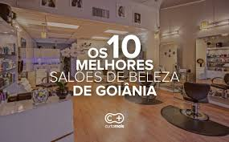

# 💄 Clinic e Beauty

Este projeto é um catálogo virtual para o **Clinic e Beauty**, com foco na apresentação de serviços estéticos de forma visual e organizada.

## 🌐 Demonstração

Confira a interface do projeto:

## 📋 Descrição

Este site estático foi desenvolvido para promover os serviços oferecidos no Studio, incluindo:

- Lash Lifting  
- Design + Henna  
- Protocolo de Crescimento  
- Limpeza de Pele  

Cada serviço é apresentado com imagem, descrição detalhada, valor e botão de adição ao carrinho (simulado).

A ideia do projeto foi facilitar e agilizar o contato com o cliente, otimizando o tempo de atendimento. Ao exibir todo o catálogo de serviços de forma clara e organizada, reduz-se o número de mensagens trocadas nas redes sociais e aumenta-se o poder de atração de novos clientes.

## 🛠️ Tecnologias Utilizadas

- **HTML5** – Estruturação do conteúdo.  
- **Tailwind CSS** – Estilização moderna, responsiva e personalizada.  
- **Font Awesome** – Ícones do carrinho e interações.  
- **Google Fonts** – Tipografia com Poppins e Roboto.  
- **CSS Customizado** – Ajustes e animações específicas para cartões de serviço.

## 📱 Responsividade

O layout foi otimizado para funcionar corretamente em:

- 📱 Dispositivos móveis  
- 💻 Notebooks  
- 🖥️ Telas maiores

